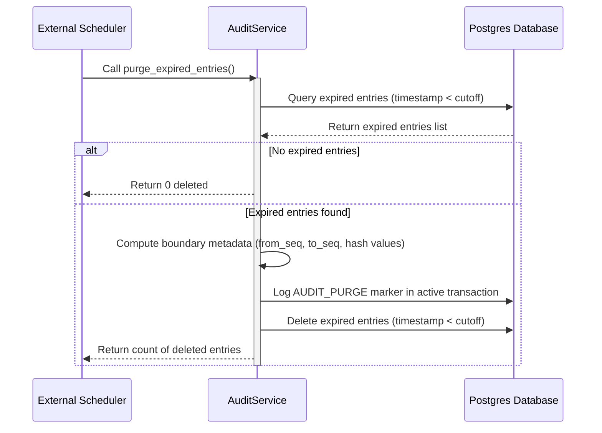

# Audit Log Purge Scheduler Operational Guide

To satisfy data privacy regulations, system resource constraints, and compliance mandates (e.g., FR-142), QueryCraft implements an automated retention policy for audit logs. Audit log entries that fall outside the configured retention window can be purged from the database.

This document details how to trigger this process, configure external schedulers, and understand the internal cryptographic verification guarantees of the platform.

---

## Architecture and Scope Constraint

> [!IMPORTANT]  
> **The QueryCraft platform does NOT manage, execute, or display the schedule/timing of the audit purge process.**  
> Scheduling, executing, and reporting the execution times of the purge process are delegated entirely to external systems (such as cron, Kubernetes CronJobs, systemd timers, or enterprise job schedulers). QueryCraft exposes only the service primitive to execute the purge.

---

## Execution Interface

The core logic is implemented in the backend application's `AuditService.purge_expired_entries()` service primitive. To execute the purge safely, operators run a lightweight Python script that initializes the database session, calls the service, commits the transaction, and cleans up connections.

### Standalone Python Script Example

Below is a standard Python runner script (`scripts/purge_audit_logs.py`) that can be executed in the backend environment.

```python
"""Script to invoke the AuditService purge logic from an external scheduler."""
import asyncio
import logging
import sys
from app.db.base import get_async_session_factory, dispose_engine
from app.services.audit_service import AuditService

# Configure basic logging for operational visibility
logging.basicConfig(
    level=logging.INFO,
    format="%(asctime)s [%(levelname)s] %(name)s: %(message)s",
    stream=sys.stdout
)
logger = logging.getLogger("audit_purge_cron")

async def main() -> None:
    logger.info("Initializing database session factory...")
    session_factory = get_async_session_factory()
    
    async with session_factory() as session:
        try:
            logger.info("Starting audit log purge...")
            # retention_months defaults to Settings.AUDIT_RETENTION_MONTHS if None
            deleted_count = await AuditService.purge_expired_entries(session, retention_months=None)
            
            # Commit the deletions and purge marker insertion in the same transaction
            await session.commit()
            
            logger.info("Audit log purge completed successfully. Deleted %d row(s).", deleted_count)
        except Exception as e:
            logger.error("Error occurred during audit log purge, rolling back transaction: %s", e, exc_info=True)
            await session.rollback()
            sys.exit(1)
        finally:
            logger.info("Disposing database engine connections...")
            await dispose_engine()

if __name__ == "__main__":
    asyncio.run(main())
```

---

## Scheduling Integration Examples

Operators can schedule the python runner script above using any of the following operational models.

### 1. Unix Cron (Standard Crontab)

For simple single-server environments, standard Unix `cron` is the most common execution pattern.

#### Example Cron Expression
Running the purge daily at **2:00 AM**:
```text
0 2 * * * cd /opt/querycraft/backend && .venv/bin/python scripts/purge_audit_logs.py >> /var/log/querycraft/audit-purge.log 2>&1
```

Or hourly at the start of the hour:
```text
0 * * * * cd /opt/querycraft/backend && .venv/bin/python scripts/purge_audit_logs.py >> /var/log/querycraft/audit-purge.log 2>&1
```

---

### 2. Kubernetes CronJob

In containerized Kubernetes deployments, the purge should run as a `CronJob` resource in the same cluster/namespace as the application backend.

#### Example CronJob Spec
```yaml
apiVersion: batch/v1
kind: CronJob
metadata:
  name: querycraft-audit-purge
  namespace: querycraft
  labels:
    app.kubernetes.io/component: cronjob
    app.kubernetes.io/part-of: querycraft
spec:
  # Schedule: Run daily at 2:00 AM
  schedule: "0 2 * * *"
  concurrencyPolicy: Forbid
  successfulJobsHistoryLimit: 3
  failedJobsHistoryLimit: 5
  jobTemplate:
    spec:
      template:
        metadata:
          labels:
            app: querycraft-audit-purge
        spec:
          restartPolicy: OnFailure
          containers:
            - name: purge-worker
              image: querycraft-backend:latest
              command: ["python", "scripts/purge_audit_logs.py"]
              envFrom:
                - configMapRef:
                    name: querycraft-backend-config
                - secretRef:
                    name: querycraft-backend-secrets
```

---

### 3. systemd Timer

In modern Linux distributions, systemd timers provide advanced logging, resource gating, and robust scheduling properties.

#### Service Unit (`/etc/systemd/system/querycraft-audit-purge.service`)
```ini
[Unit]
Description=QueryCraft Audit Log Purge Service
After=network.target postgresql.service redis.service

[Service]
Type=oneshot
User=querycraft
Group=querycraft
WorkingDirectory=/opt/querycraft/backend
EnvironmentFile=/opt/querycraft/backend/.env
ExecStart=/opt/querycraft/backend/.venv/bin/python scripts/purge_audit_logs.py
StandardOutput=journal
StandardError=journal

[Install]
WantedBy=multi-user.target
```

#### Timer Unit (`/etc/systemd/system/querycraft-audit-purge.timer`)
```ini
[Unit]
Description=Run QueryCraft Audit Log Purge Daily

[Timer]
# Run every day at 2:00 AM
OnCalendar=*-*-* 02:00:00
# Ensure randomized delay to prevent thundering herds on multi-node DBs
RandomizedDelaySec=600
Persistent=true

[Install]
WantedBy=timers.target
```

To enable and start the timer:
```bash
sudo systemctl daemon-reload
sudo systemctl enable --now querycraft-audit-purge.timer
```

---

## Expected System Behavior

When the external scheduler invokes `AuditService.purge_expired_entries()`, the following sequence of events occurs internally:



### 1. `audit.purge` Marker Insertion
Before any expired entries are deleted, the system generates an `audit.purge` (using the `AuditActionType.AUDIT_PURGE` type) marker entry and inserts it in the **same transaction**.
This marker context includes cryptographically bound metadata that catalogs the deleted sequence numbers and validates the log boundary:
- `purged_from_seq`: Sequence number of the oldest deleted entry.
- `purged_to_seq`: Sequence number of the newest deleted entry.
- `purged_count`: Total count of deleted entries.
- `retention_months`: The active retention window setting under which the purge ran.
- `last_retained_hash`: The SHA-256 cryptographic hash of the youngest deleted (purged) entry.
- `last_retained_seq`: The sequence number of the youngest deleted entry.
- `first_surviving_seq`: The sequence number of the oldest remaining (surviving) entry.
- `first_surviving_prev_hash`: The `prev_hash` value of the oldest remaining entry (which points back to the deleted one).

### 2. Expired Entries Deletion
After successfully inserting the marker, all `AuditLogEntry` rows older than the calculated cutoff date are permanently deleted from the database. The entire operation is executed atomically inside a transaction; if either the marker insertion or the deletion fails, the database rolls back to its original state.

### 3. Cryptographic Chain Integrity (`verify_chain()`)
Because deleting log entries creates a gap in the sequence numbers and breaks the SHA-256 hash linkage of `prev_hash` on the first surviving entry, the chain validation logic (`verify_chain()`) handles these gaps:
- When checking the log integrity, if the validator encounters a broken linkage (the `prev_hash` of an entry does not match the previous entry in the log), it looks up the `audit.purge` markers.
- If it finds a valid `audit.purge` marker where `first_surviving_seq` and `first_surviving_prev_hash` match the orphaned entry's sequence number and `prev_hash` value, it treats the gap as an intentional purge gap.
- The validator marks this segment as secure and continues verifying the rest of the chain. If no matching marker exists, the validator marks the chain as **tampered** (broken status).

### 4. Retention Status API Endpoint
Once a purge has completed successfully, the updated status is immediately queryable via the retention API:
- Endpoint: `GET /admin/audit/retention`
- Access: Requires authentication and the `admin.audit.verify` permission.
- The API queries the most recent `audit.purge` marker in the database to fetch the `last_purge_at` timestamp and `purged_count`. It returns:
  ```json
  {
    "retention_months": 24,
    "last_purge_at": "2026-07-01T02:00:00+00:00",
    "purged_count": 482
  }
  ```
