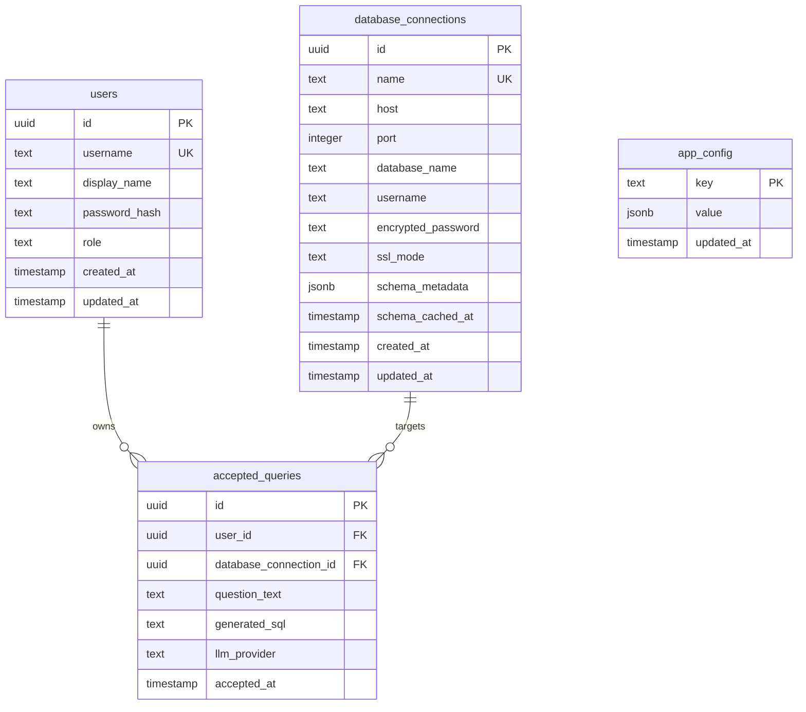

# Data Model: Core Text-to-SQL Vertical Slice

**Branch**: `001-core-text-to-sql` | **Date**: 2026-05-03  
**Spec**: [spec.md](file:///home/avril/querycraft/specs/001-core-text-to-sql/spec.md)

## Overview

The platform maintains its own **metadata database** (PostgreSQL 16) for user accounts, accepted queries, and application configuration. This is separate from the **source database** (the customer's PostgreSQL data) which is read-only.

All tables use UUIDs as primary keys, carry timestamp columns, and attribute ownership to a `user_id` where applicable (per FR-027).

## Entity-Relationship Diagram

---

## Table Definitions

### `users`

The provisional administrator account. Exactly one row in Phase 1, seeded at deployment.

| Column | Type | Constraints | Notes |
|--------|------|------------|-------|
| `id` | `UUID` | PK, default `gen_random_uuid()` | Immutable. Referenced by all persisted records. |
| `username` | `TEXT` | UNIQUE, NOT NULL | Login identifier. |
| `display_name` | `TEXT` | NOT NULL | Shown in the UI. |
| `password_hash` | `TEXT` | NOT NULL | Argon2id hash. Raw password never stored. |
| `role` | `TEXT` | NOT NULL, default `'admin'` | Phase 1: always `'admin'`. Future phases add roles. |
| `created_at` | `TIMESTAMPTZ` | NOT NULL, default `now()` | Row creation time. |
| `updated_at` | `TIMESTAMPTZ` | NOT NULL, default `now()` | Updated on mutation. |

**Indexes**: Unique on `username`.

**Validation rules**:
- `username`: 3–64 characters, alphanumeric + underscore.
- `password_hash`: Produced by `argon2-cffi`; never exposed outside the repository layer.
- `role`: Enum-like check (`admin` in Phase 1; extensible).

---

### `database_connections`

The configured source database. Exactly one row in Phase 1.

| Column | Type | Constraints | Notes |
|--------|------|------------|-------|
| `id` | `UUID` | PK, default `gen_random_uuid()` | |
| `name` | `TEXT` | UNIQUE, NOT NULL | Human-readable label (e.g., "Production Analytics"). |
| `host` | `TEXT` | NOT NULL | Hostname or IP. |
| `port` | `INTEGER` | NOT NULL, default `5432` | |
| `database_name` | `TEXT` | NOT NULL | PostgreSQL database name. |
| `username` | `TEXT` | NOT NULL | Read-only role name. |
| `encrypted_password` | `TEXT` | NOT NULL | AES-256-GCM encrypted. Format: `base64(iv \|\| ciphertext \|\| tag)`. Decrypted only at connection time via `core/encryption.py` using `PLATFORM_ENCRYPTION_KEY` env var (base64-encoded 32-byte key). See R-008 for the full encryption contract. |
| `ssl_mode` | `TEXT` | NOT NULL, default `'require'` | PostgreSQL sslmode value. |
| `schema_metadata` | `JSONB` | | Cached introspection result (tables, columns, types, FKs). |
| `schema_cached_at` | `TIMESTAMPTZ` | | When schema_metadata was last refreshed. |
| `created_at` | `TIMESTAMPTZ` | NOT NULL, default `now()` | |
| `updated_at` | `TIMESTAMPTZ` | NOT NULL, default `now()` | |

**Indexes**: Unique on `name`.

**Validation rules**:
- `host`: Non-empty, valid hostname or IP.
- `port`: 1–65535.
- `ssl_mode`: One of `disable`, `allow`, `prefer`, `require`, `verify-ca`, `verify-full`.

**Notes**:
- Credentials are configured at the platform level (Constitution Principle VIII). The API never accepts source-DB credentials from users.
- `schema_metadata` stores the introspection cache as JSONB to avoid a separate introspection query on every request. Refreshed by TTL (default 5 min) or manual admin trigger (`POST /api/v1/admin/refresh-schema`).
- The source database connection is NOT seeded via Alembic. Instead, on FastAPI startup (lifespan event), the application reads connection parameters from environment variables and upserts a row into `database_connections` if a row with the matching `name` does not already exist. This keeps infrastructure config out of migrations.

---

### `accepted_queries`

The user's history of accepted question-answer pairs. No upper bound on row count (per FR-021 clarification).

| Column | Type | Constraints | Notes |
|--------|------|------------|-------|
| `id` | `UUID` | PK, default `gen_random_uuid()` | |
| `user_id` | `UUID` | FK → `users.id`, NOT NULL | Per FR-027: every record carries user identity. |
| `database_connection_id` | `UUID` | FK → `database_connections.id`, NOT NULL | Which source DB was queried. |
| `question_text` | `TEXT` | NOT NULL | Original natural-language question. Max 2,000 chars per FR-007. |
| `generated_sql` | `TEXT` | NOT NULL | The evaluator-passed, user-accepted SQL. |
| `llm_provider` | `TEXT` | NOT NULL | Which provider generated this SQL (e.g., `"anthropic"`, `"openai"`). |
| `accepted_at` | `TIMESTAMPTZ` | NOT NULL, default `now()` | When the user clicked Accept. Serves as both the business timestamp and the row creation timestamp. |

**Indexes**:
- `idx_accepted_queries_user_id_accepted_at` on `(user_id, accepted_at DESC)` — supports reverse-chronological history listing and cursor-based pagination.

**Validation rules**:
- `question_text`: 1–2,000 characters, non-whitespace (mirrored from FR-007).
- `generated_sql`: Non-empty. Must have passed the evaluator.
- Only the Accept handler writes to this table (Constitution Principle III). Reject and Regenerate handlers never touch it.

**State transitions**:
- A `GenerationAttempt` is ephemeral (stored in Redis with a 15-minute TTL). Only when the user clicks Accept does a row materialize in `accepted_queries`.
- Rejected and evaluator-failed attempts are discarded. They do not exist in any persistent table (per FR-020).

---

### `app_config`

Key-value store for runtime configuration. Used sparingly; most configuration comes from environment variables.

| Column | Type | Constraints | Notes |
|--------|------|------------|-------|
| `key` | `TEXT` | PK | Configuration key (e.g., `"query_timeout_seconds"`, `"max_question_length"`). |
| `value` | `JSONB` | NOT NULL | The configuration value. JSONB allows typed values (number, string, boolean). |
| `updated_at` | `TIMESTAMPTZ` | NOT NULL, default `now()` | Last modification time. |

**Seed data** (Phase 1):

| Key | Default Value | Source |
|-----|---------------|--------|
| `query_timeout_seconds` | `30` | Spec Assumptions |
| `max_question_length` | `2000` | FR-007 |
| `session_idle_timeout_hours` | `8` | FR-003 |
| `schema_cache_ttl_seconds` | `300` | R-003 |
| `max_schema_tokens` | `60000` | R-003 / I |

---

## Ephemeral Entities (Not Persisted to PostgreSQL)

### `GenerationAttempt`

Stored in Redis under `attempt:{attempt_id}` with a 15-minute TTL. Represents the LLM's response before the user's accept/reject decision. The attempt is NOT stored in the platform database — it exists only in Redis during the interactive lifecycle.

| Field | Type | Notes |
|-------|------|-------|
| `attempt_id` | `str` (UUID) | Unique identifier for this attempt. Used as the Redis key suffix and the API's `attempt_id` field. |
| `session_id` | `str` | The session that created this attempt. Used for ownership validation. |
| `user_id` | `str` (UUID) | The user who submitted the question. |
| `question_text` | `str` | The original question. |
| `generated_sql` | `str` | SQL returned by the LLM. |
| `llm_provider` | `str` | Which provider was used. |
| `attempt_number` | `int` | 1 for first attempt, 2 for retry. |
| `rejected_sqls` | `list[str]` | SQL strings rejected so far for this question. Used as negative context for retries. |

### `EvaluatorResult`

The evaluator's verdict for a generation attempt.

| Field | Type | Notes |
|-------|------|-------|
| `passed` | `bool` | `True` if all rules passed. |
| `violations` | `list[EvaluatorViolation]` | Empty if passed. |

### `EvaluatorViolation`

A single rule failure.

| Field | Type | Notes |
|-------|------|-------|
| `rule_name` | `str` | Which rule failed (e.g., `"read_only_check"`, `"schema_validation"`). |
| `message_key` | `str` | i18n key for the violation message. |
| `severity` | `str` | `"error"` (blocks execution) or `"warning"` (logged, future use). |

---

## Session Storage (Redis)

Sessions are stored in Redis, not in the platform database.

| Key Pattern | Value | TTL |
|-------------|-------|-----|
| `session:{session_id}` | JSON: `{"user_id": "...", "username": "...", "role": "...", "created_at": "...", "last_activity": "..."}` | 8 hours (idle timeout), reset on activity |

**Notes**:
- Session ID is a cryptographically random 32-byte hex string, stored in a secure HttpOnly cookie.
- On each authenticated request, the middleware reads the session from Redis, checks `last_activity` against the idle timeout, and updates `last_activity` if valid.
- On sign-out, the session key is deleted from Redis.

---

## Ephemeral Attempt Storage (Redis)

Generation attempts are stored in Redis to survive across the submit → accept/reject/regenerate request cycle. They are never written to the platform database.

| Key Pattern | Value | TTL |
|-------------|-------|-----|
| `attempt:{attempt_id}` | JSON: `{"attempt_id": "...", "session_id": "...", "user_id": "...", "question_text": "...", "generated_sql": "...", "llm_provider": "...", "attempt_number": 1, "rejected_sqls": []}` | 15 minutes (fixed) |

**Lifecycle**:

1. **`POST /query/submit`**: `QueryService` generates SQL via the LLM, evaluates it, executes it against the source DB. If successful, writes the attempt to Redis under `attempt:{attempt_id}` with a 15-minute TTL and returns a `QueryResult` (with `kind: "result"`).

2. **`POST /query/accept`**: `QueryService` reads the attempt from Redis by `attempt_id`, validates that `session_id` matches the current session (ownership check), persists the question/SQL/metadata to `accepted_queries`, then deletes the Redis key.

3. **`POST /query/reject` / `POST /query/regenerate`**: `QueryService` reads the attempt from Redis by `attempt_id`, validates session ownership. Appends the current `generated_sql` to `rejected_sqls`. Calls the LLM with `rejected_sqls` as negative context. If the new SQL is byte-equal to any entry in `rejected_sqls`, or if `attempt_number` is already 2 (max retries reached), deletes the Redis key and returns a `RefinePrompt` (with `kind: "refine"`). Otherwise, replaces the Redis value with the new attempt (`attempt_number: 2`, updated `generated_sql`, extended `rejected_sqls`) and returns a new `QueryResult`.

**Invariants**:
- The `attempt_id` in accept/reject/regenerate MUST match an existing Redis key. If the key has expired or does not exist, the handler returns `400 Bad Request`.
- The `session_id` stored in the attempt MUST match the current session. If not, the handler returns `400 Bad Request` (prevents cross-session attempt hijacking).
- Attempts are never written to PostgreSQL. Only the `accept` path writes to `accepted_queries`.

---

## Schema Token Limit Escalation

On each schema introspection refresh (TTL-based or manual), the `Introspector` computes the approximate token count of the schema context string using a tiktoken-compatible estimator. If the token count exceeds the configurable `max_schema_tokens` (default: 60,000), the introspector raises a `SchemaTokenLimitExceeded` configuration error. This error:
- Fails the next query submission with an operator-actionable error message identifying which database connection exceeded the limit.
- Is logged at `ERROR` level via structlog with the computed token count and the configured limit.
- Does NOT crash the application — other operations (auth, history) continue to function.
- Requires the operator to reduce the schema size (e.g., restrict the read-only role to relevant schemas) or increase `max_schema_tokens` in `app_config`.

---

## Migration Strategy

- Alembic manages schema migrations for the platform metadata database.
- Initial migration (`001_initial_schema`) creates all four tables.
- Seed migration (`002_seed_admin_user`) inserts the provisional administrator account with a hashed password from environment variables.
- The source database connection is NOT managed by Alembic. On FastAPI startup (lifespan event), the application reads source DB parameters from environment variables (`SOURCE_DB_*`) and upserts a row into `database_connections` if a row with the matching `name` does not already exist. This ensures the connection configuration is infrastructure-driven, not migration-driven.
- All migrations are idempotent and reversible.
