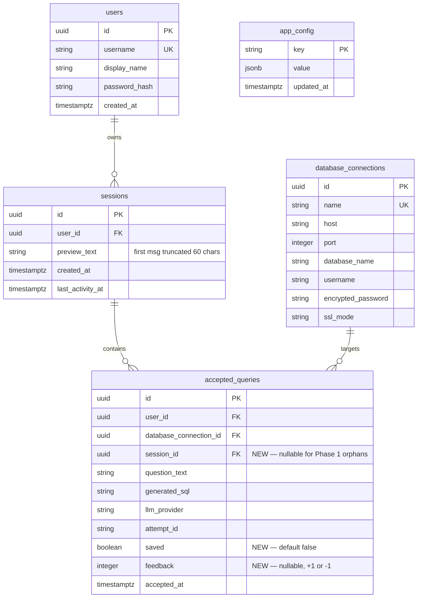
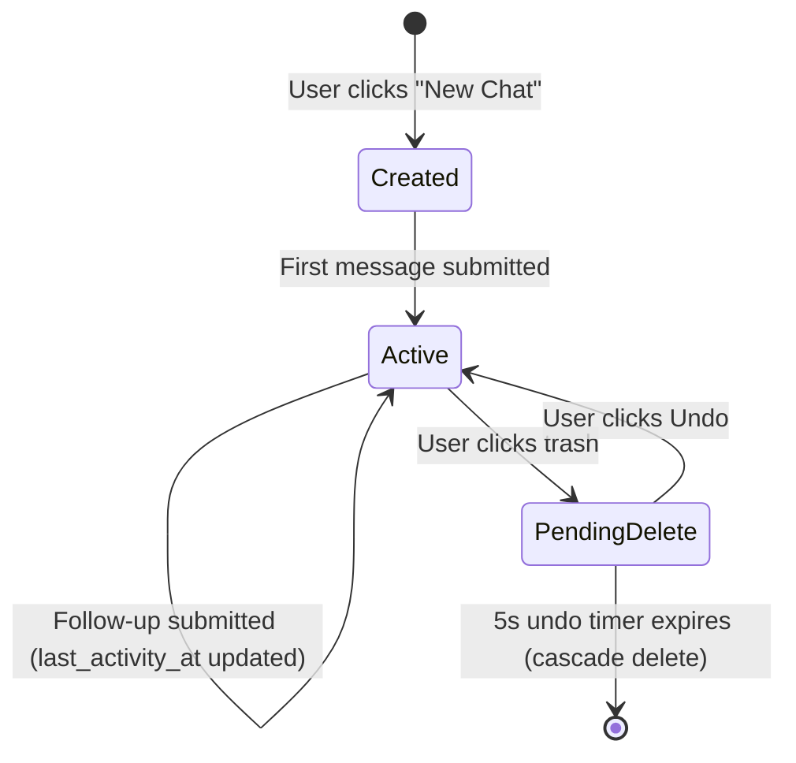
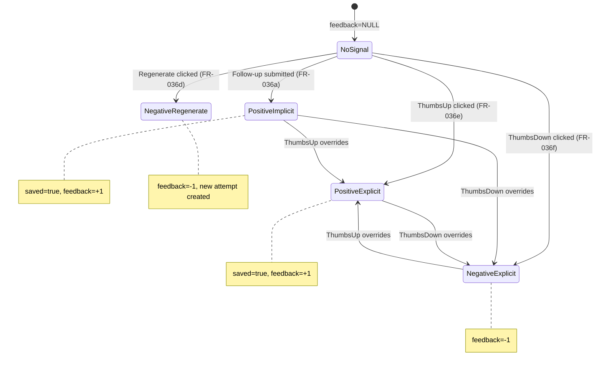

# Phase 2 Data Model

## Entity Relationship Diagram

## New Entity: Session

| Field | Type | Constraints | Notes |
|-------|------|-------------|-------|
| `id` | `UUID` | PK, `gen_random_uuid()` | |
| `user_id` | `UUID` | FK → `users.id`, NOT NULL | |
| `preview_text` | `VARCHAR(63)` | NULL | First user message, hard-truncated to 60 chars + "..." (ADR-2). NULL until first message submitted. |
| `created_at` | `TIMESTAMPTZ` | NOT NULL, `now()` | |
| `last_activity_at` | `TIMESTAMPTZ` | NOT NULL, `now()` | Updated on each new query submission in the session. Used for chronological grouping. |

**Cascade**: `ON DELETE CASCADE` from sessions to accepted_queries.

**Indexes**:
- `ix_sessions_user_id_last_activity` on `(user_id, last_activity_at DESC)` — sidebar listing query.

## Extended Entity: AcceptedQuery

New columns added to existing `accepted_queries` table:

| Field | Type | Constraints | Notes |
|-------|------|-------------|-------|
| `session_id` | `UUID` | FK → `sessions.id` ON DELETE CASCADE, NULLABLE | Nullable for backward compatibility with Phase 1 orphan rows. |
| `saved` | `BOOLEAN` | NOT NULL, DEFAULT `false` | Set to `true` when user clicks ThumbsUp or implicit +1 on follow-up. |
| `feedback` | `SMALLINT` | NULLABLE | `+1` = positive, `-1` = negative. NULL = no signal yet. |

## Extended Entity: AppConfig

New seed row (uses existing key-value table):

| Key | Default Value | Validation | Notes |
|-----|---------------|------------|-------|
| `llm_context_cap` | `3` | Integer 0–10 | Admin-configurable via settings endpoints. |

## State Transitions

### Session Lifecycle

### Feedback Signal Lifecycle (per AcceptedQuery)

## Migration Plan

**File**: `backend/alembic/versions/004_add_sessions_and_extend_accepted_queries.py`

Operations (in order):
1. `CREATE TABLE sessions (...)` with FK to users, cascade semantics
2. `CREATE INDEX ix_sessions_user_id_last_activity ON sessions (user_id, last_activity_at DESC)`
3. `ALTER TABLE accepted_queries ADD COLUMN session_id UUID REFERENCES sessions(id) ON DELETE CASCADE`
4. `ALTER TABLE accepted_queries ADD COLUMN saved BOOLEAN NOT NULL DEFAULT false`
5. `ALTER TABLE accepted_queries ADD COLUMN feedback SMALLINT`
6. `CREATE INDEX ix_accepted_queries_session_id ON accepted_queries (session_id)`
7. `INSERT INTO app_config (key, value) VALUES ('llm_context_cap', '3') ON CONFLICT DO NOTHING`

Downgrade reverses in opposite order.
