# Phase 2 Implementation Plan — Premium Dark-Mode UI + Constitution VI + Backend Hardening

**Branch**: `002-phase2-premium-ui-rtl`
**Spec**: [spec.md](file:///home/avril/QueryCraft/specs/002-phase2-premium-ui-rtl/spec.md)
**Research**: [research.md](file:///home/avril/QueryCraft/specs/002-phase2-premium-ui-rtl/research.md)
**Data Model**: [data-model.md](file:///home/avril/QueryCraft/specs/002-phase2-premium-ui-rtl/data-model.md)
**Contracts**: [api-contracts.md](file:///home/avril/QueryCraft/specs/002-phase2-premium-ui-rtl/contracts/api-contracts.md)

---

## Technical Context

| Dimension | Value |
|-----------|-------|
| Backend framework | FastAPI 0.115+ / Python 3.12 / SQLAlchemy 2 async / asyncpg / Redis |
| Frontend framework | React 19 / Vite 8 / Tailwind v4 (CSS-first `@theme`) / TypeScript 6 |
| State management | **Zustand 5** (UI) + **TanStack Query 5** (server state, already installed) |
| Syntax highlighter | **Shiki 3**, lazy-loaded, custom QueryCraft dark theme |
| Icons | **lucide-react** (already installed ^1.14.0) — barrel of ~13 icons |
| Fonts | **Inter** (sans) + **JetBrains Mono** (mono) via `@fontsource-variable` |
| i18n | i18next (already installed) — en.json + ar.json |
| Test runner (BE) | pytest + pytest-asyncio + testcontainers |
| Test runner (FE) | Vitest + @testing-library/react + Playwright |
| LLM mock library | **respx** (already in dev deps) |
| DB migrations | Alembic (3 existing migrations; next = 004) |
| Package manager | uv (backend) / npm (frontend) |

## Constitution Check

| Principle | Phase 2 Status | Notes |
|-----------|---------------|-------|
| I — Security | ✅ Preserved | New admin endpoints use existing `X-Admin-Key` auth |
| II — Query Validation | ✅ Preserved | No changes to evaluator pipeline |
| III — Validated Knowledge | ✅ Extended | Sessions group attempts; each attempt remains discrete |
| IV — Hostile Input | ⏸ Deferred | Phase 3 per §11 |
| V — LLM-Agnostic | ✅ Extended | Contract tests verify wire format compatibility |
| VI — Arabic + RTL | 🟢 **ACTIVATED** | Full RTL layout + Arabic translations |
| VII — Role Auth | ⏸ Deferred | Phase 3 per §11 |
| VIII — DB Access | ✅ Preserved | No changes |
| IX — Audit Log | ⏸ Foundation | Feedback table lays groundwork; full log Phase 3 |
| X — Quotas | ⏸ Deferred | Phase 3 per §11 |
| XI — Modularity | ✅ Preserved | New routers/services follow existing patterns |
| XII — API Contract | ✅ Preserved | New endpoints auto-generated in OpenAPI, client regenerated |

**Quality Gate Compliance**:
1. ✅ New endpoints reflected in auto-generated OpenAPI + frontend client regen
2. ✅ No new SQL-generation path (existing evaluator pipeline unchanged)
3. ⏸ Audit log deferred per §11 (no PII boundary in Phase 2)
4. ✅ New data access paths use existing session middleware auth
5. ✅ All new text extracted to i18n; RTL verified via Playwright snapshots

---

## Wave Structure

Phase 2 = 3 parallel streams. 2A is sequential internally. 2B and 2C are fully independent.

```mermaid
gantt
    title Phase 2 Dispatch Order
    dateFormat X
    axisFormat %s

    section Stream 2A
    Wave 8.0 Foundation    :w80, 0, 1
    Wave 8.1 Shell         :w81, after w80, 1
    Wave 8.2 Workspace     :w82, after w81, 1
    Wave 8.3 Actions+Admin :w83, after w82, 1
    Wave 8.4 RTL+Polish    :w84, after w83, 1

    section Stream 2B
    Wave 9 LLM Contract    :w9, 0, 1

    section Stream 2C
    Wave 10 Lifecycle Tests :w10, 0, 1
```



---

## Per-Wave Quality Gates (apply to ALL waves)

- Backend: `uv run pytest`, `uv run ruff check`, `uv run ruff format --check`
- Frontend: `npm run test`, `npm run lint`, `npm run typecheck`, `npm run build`
- Constitution VI lint: `npm run lint:css` (stylelint physical-direction ban), i18n key completeness
- All commits reference T-IDs
- PR descriptions reference FR + SC numbers

---

## Wave 8.0 — Foundation (Backend Scaffold + Frontend Scaffold)

**PR scope**: Backend data layer + API endpoints + frontend design tokens + state management scaffold. NO visible UI change. Existing pages still render and pass tests.

**Verifies**: SC-014, SC-018, SC-019

### Backend Changes

#### [NEW] `backend/alembic/versions/004_add_sessions_and_extend_accepted_queries.py`
- Create `sessions` table (id, user_id FK, preview_text, created_at, last_activity_at)
- Add `session_id` (FK, nullable, CASCADE), `saved` (bool, default false), `feedback` (smallint, nullable) to `accepted_queries`
- Seed `app_config` row: `llm_context_cap = 3`
- Index: `ix_sessions_user_id_last_activity`, `ix_accepted_queries_session_id`

#### [NEW] `backend/src/app/db/models/session.py`
- `Session` SQLAlchemy model with relationship to `AcceptedQuery`

#### [MODIFY] `backend/src/app/db/models/__init__.py`
- Export `Session` model

#### [MODIFY] `backend/src/app/db/models/accepted_query.py`
- Add `session_id`, `saved`, `feedback` columns

#### [NEW] `backend/src/app/repositories/session_repository.py`
- `create()`, `list_by_user()`, `get_by_id()`, `delete()`, `update_last_activity()`, `update_preview_text()`

#### [MODIFY] `backend/src/app/repositories/accepted_query_repository.py`
- T-259 refactor: Add `list_by_session()` (for loading conversation history), `update_feedback()`, `get_latest_by_session()` methods

#### [NEW] `backend/src/app/schemas/session.py`
- `CreateSessionResponse`, `SessionSummary`, `SessionDetail`, `AttemptSummary`, `SessionListResponse`

#### [NEW] `backend/src/app/schemas/feedback.py`
- `UpdateFeedbackRequest`, `FeedbackResponse`

#### [NEW] `backend/src/app/schemas/admin_settings.py`
- `AdminSettingsResponse`, `UpdateAdminSettingsRequest`, `UpdateAdminSettingsResponse`

#### [MODIFY] `backend/src/app/schemas/query.py`
- Add optional `session_id: str | None = None` to `SubmitQuestionRequest`

#### [NEW] `backend/src/app/api/v1/sessions.py`
- `POST /sessions` — create session
- `GET /sessions` — list sessions for user
- `GET /sessions/:id` — get session detail with conversation history
- `DELETE /sessions/:id` — delete session (cascade + in-flight cancellation per FR-058)

#### [NEW] `backend/src/app/api/v1/feedback.py`
- `PATCH /feedback/:attempt_id` — update feedback on an accepted query

#### [MODIFY] `backend/src/app/api/v1/admin.py`
- T-257 fix: Add `GET /admin/settings` and `PATCH /admin/settings` for LLM context cap
- Both use existing `_require_admin_key()` auth

#### [MODIFY] `backend/src/app/services/query_service.py`
- Extend `submit_question()`: accept optional `session_id`, load last N completed attempts (FR-035 clarification: skip pending), pass to prompt builder
- Apply implicit feedback on follow-up (FR-036a)
- Update `session.last_activity_at` and `session.preview_text` on first message

#### [MODIFY] `backend/src/app/llm/prompt_builder.py`
- Extend `build_prompt()` to accept optional `conversation_history: list[dict]` parameter

#### [MODIFY] `backend/src/app/main.py`
- Register sessions and feedback routers

#### Backend Tests
- Unit: session repository CRUD, feedback update, accepted_query new methods
- Integration: session creation, listing, deletion cascade, feedback PATCH, admin settings GET/PATCH
- Acceptance: full submit-with-session-context flow, implicit feedback on follow-up

### Frontend Changes

#### [MODIFY] `frontend/src/index.css`
- Add `@theme` block with QueryCraft design tokens:
  - Colors: `--color-obsidian-*` (900→50), `--color-neon-cyan`, `--color-neon-purple`, `--color-neon-fuchsia`
  - Fonts: `--font-sans: 'Inter Variable'`, `--font-mono: 'JetBrains Mono'`
  - Keyframes: `gradient-shift`, `glow-pulse`, `fade-in`
- Import fontsource packages

#### [NEW] `frontend/src/stores/uiStore.ts`
- Zustand store: `sidebarCollapsed` (persisted), `activeSessionId`, `hoveredSessionId`, `promptDraft`

#### [NEW] `frontend/src/hooks/useSessions.ts`
- TanStack Query hooks: `useSessionsList()`, `useSessionDetail(id)`, `useCreateSession()`, `useDeleteSession()`

#### [NEW] `frontend/src/hooks/useFeedback.ts`
- TanStack Query hooks: `useUpdateFeedback()`

#### [NEW] `frontend/src/hooks/useAdminSettings.ts`
- TanStack Query hooks: `useAdminSettings()`, `useUpdateAdminSettings()`

#### [NEW] `frontend/src/components/icons.ts`
- Barrel export: Plus, Sparkles, Copy, RefreshCw, ThumbsUp, ThumbsDown, Trash2, PanelLeftClose, PanelLeftOpen, Send, Download, Settings, X

#### [MODIFY] `frontend/src/locales/en.json` + `frontend/src/locales/ar.json`
- Add ~25 new i18n keys for session, feedback, sidebar, workspace, and admin settings UI

#### [MODIFY] `frontend/package.json`
- Add deps: `zustand`, `@fontsource-variable/inter`, `@fontsource/jetbrains-mono`, `shiki`

#### Frontend Tests
- Unit: uiStore default state + persistence, TanStack hooks mock API responses
- Existing AskQuestionPage + HistoryPage tests still pass (SC-014)

---

## Wave 8.1 — Shell (AppShell + Sidebar + Routing)

**PR scope**: AppShell layout, Sidebar with session list, WorkspacePage routing, delete-with-undo. Sidebar is feature-complete; chat workspace shows placeholder.

**Verifies**: FR-031, FR-032, FR-033, FR-034, FR-043, FR-049, FR-051, SC-023

**Dependencies**: Wave 8.0 merged (imports Zustand store, Tailwind tokens, TanStack hooks)

### Frontend Changes

#### [NEW] `frontend/src/components/shell/AppShell.tsx` + `.css`
- 2-column desktop layout (FR-049): collapsible sidebar + workspace
- `dir` attribute bound to i18n language direction
- Basic responsive breakpoints

#### [NEW] `frontend/src/components/sidebar/Sidebar.tsx` + `.css`
- QueryCraft logo with gradient text + glow (FR-051)
- Collapse/expand toggle (PanelLeftClose/PanelLeftOpen icons)
- "New Chat" CTA with accent glow border
- Session list grouped by Today / Previous 7 Days / Older (FR-034)

#### [NEW] `frontend/src/components/sidebar/SessionItem.tsx` + `.css`
- Session preview text (FR-043: truncated to 60 chars + ellipsis)
- Hover → trash icon appears
- Click → set active session
- Active state styling

#### [NEW] `frontend/src/components/sidebar/UndoToast.tsx` + `.css`
- 5-second countdown timer (SC-023: ±500ms tolerance)
- "Undo" button restores session
- Auto-dismiss triggers permanent DELETE
- Multiple toasts stack

#### [NEW] `frontend/src/pages/WorkspacePage.tsx`
- Receives active session from Zustand store
- Empty state: "Start a new conversation" prompt
- Active session: placeholder (chat UI ships in Wave 8.2)

#### [MODIFY] `frontend/src/App.tsx`
- Replace direct AskQuestionPage/HistoryPage routing with AppShell wrapper
- WorkspacePage as default authenticated route
- Preserve SignInPage route

#### Frontend Tests
- Unit: Sidebar renders session groups correctly, UndoToast timer behavior
- Integration: Create session → appears in sidebar, delete → undo → restore
- Playwright: Visual snapshot of sidebar in LTR + RTL

---

## Wave 8.2 — Workspace (Chat UI Components)

**PR scope**: UserBubble, AssistantResponseCard, SqlCodeBlock, ResultTable, PromptInput. Full conversational UI live.

**Verifies**: FR-042, FR-050, FR-052, FR-053, SC-020, SC-021, SC-022

**Dependencies**: Wave 8.1 merged (needs WorkspacePage routing)

### Frontend Changes

#### [NEW] `frontend/src/components/chat/UserBubble.tsx` + `.css`
- End-aligned (FR-053), RTL-aware (flips in RTL mode)
- Dark-styled rounded container
- All directional properties use logical equivalents (SC-021)

#### [NEW] `frontend/src/components/chat/AssistantResponseCard.tsx` + `.css`
- Cyber-purple gradient border via `p-px` wrapper trick (FR-050)
- Contains: SqlCodeBlock + action bar placeholder + ResultTable + feedback bar placeholder
- Action bars and feedback wiring ship in Wave 8.3

#### [NEW] `frontend/src/components/chat/SqlCodeBlock.tsx` + `.css`
- Shiki syntax highlighter, lazy-loaded via `React.lazy()` + `Suspense` (FR-042)
- Custom QueryCraft dark theme (obsidian bg, cyan keywords, purple strings, fuchsia operators)
- Loading skeleton while Shiki initializes

#### [NEW] `frontend/src/components/chat/ResultTable.tsx` + `.css`
- Horizontally scrollable container (FR-050)
- Alternating purple-tinted rows
- Column headers from QueryResult metadata

#### [NEW] `frontend/src/components/chat/PromptInput.tsx` + `.css`
- Sticky bottom positioning
- Rounded text area with integrated Send icon on logical end side (FR-052)
- Cyan focus glow ring
- RTL: Send button moves to left (logical end)

#### [MODIFY] `frontend/src/pages/WorkspacePage.tsx`
- Replace placeholder with full chat conversation rendering
- Message list (UserBubble + AssistantResponseCard pairs)
- PromptInput at bottom
- Wire to submit_question via existing useQuerySubmit hook extended with session_id

#### Frontend Tests
- Unit: Each component renders correctly with mock data
- Snapshot: SqlCodeBlock with sample SQL, ResultTable with sample rows
- RTL: All components render correctly in dir="rtl"

---

## Wave 8.3 — Action Bars + Admin Settings UI

**PR scope**: CodeBlockActionBar, ResponseFeedbackBar, implicit feedback wiring, admin Settings page.

**Verifies**: FR-036, FR-037, FR-038, FR-039, FR-040, SC-024

**Dependencies**: Wave 8.2 merged (modifies AssistantResponseCard)

### Frontend Changes

#### [NEW] `frontend/src/components/chat/CodeBlockActionBar.tsx` + `.css`
- Copy button (FR-037): clipboard write + brief confirmation animation
- Regenerate button (FR-038): triggers regenerate, old attempt gets feedback=-1
- ThumbsDown button: quick negative feedback

#### [NEW] `frontend/src/components/chat/ResponseFeedbackBar.tsx` + `.css`
- ThumbsUp button: +1, saved=true, selected state (FR-039)
- ThumbsDown button: -1, selected state (FR-039)
- Mutual exclusion: selecting one deselects the other

#### [MODIFY] `frontend/src/components/chat/AssistantResponseCard.tsx`
- Integrate CodeBlockActionBar into SQL code block section
- Integrate ResponseFeedbackBar at bottom

#### [MODIFY] `frontend/src/hooks/useQuerySubmit.ts`
- Wire implicit feedback on follow-up (FR-036a): prior attempt gets +1 if feedback=null
- Integrate with useFeedback mutation

#### [NEW] `frontend/src/pages/SettingsPage.tsx` + `.css`
- Admin settings UI with LLM context cap input (FR-040)
- Integer input with 0–10 validation
- Save button, success/error feedback
- Uses useAdminSettings + useUpdateAdminSettings hooks

#### [MODIFY] `frontend/src/App.tsx`
- Add `/settings` route with AuthGuard

#### Frontend Tests
- Unit: Copy button triggers clipboard API, feedback buttons toggle state
- Integration: Regenerate flow, feedback mutation
- Settings: Save context cap, validation rejection for out-of-range values

---

## Wave 8.4 — RTL Hardening + Polish Drain

**PR scope**: Full RTL visual verification, Arabic translation quality pass, lint extensions, Lighthouse audit.

**Verifies**: FR-041, FR-054, FR-055, FR-056, FR-057, SC-015, SC-020, SC-021

**Dependencies**: Wave 8.3 merged (RTL snapshots require complete UI)

### Frontend Changes

#### Playwright RTL Visual Snapshots
- Every new component: snapshot in `dir="ltr"` AND `dir="rtl"`
- Components: AppShell, Sidebar, SessionItem, WorkspacePage, UserBubble, AssistantResponseCard, SqlCodeBlock, ResultTable, PromptInput, CodeBlockActionBar, ResponseFeedbackBar, SettingsPage, UndoToast

#### Arabic Translation Quality Pass
- Replace machine-translated stubs with reviewed translations
- Ensure all ~25+ new keys have accurate Arabic translations

#### [MODIFY] `frontend/src/hooks/useDebounce.ts`
- T-253: Extract `FILTER_DEBOUNCE_MS` as named constant (FR-054)

#### [MODIFY] `frontend/.stylelintrc.json`
- T-254: Extend `property-disallowed-list` to cover `left`, `right`, `float`, `border-left-*`, `border-right-*` (FR-055)

#### [NEW/MODIFY] Frontend lint test
- T-255: Physical-tailwind test scans source directly for `ml-`, `mr-`, `pl-`, `pr-`, `left-`, `right-` classes

#### [MODIFY] i18n key completeness test
- T-256: Use `beforeAll()` to load locale files, assert all en keys exist in ar and vice versa (FR-056)

#### [MODIFY] `frontend/src/i18n.ts`
- T-260: Remove `defaultValue` fallback parameters from `t()` calls (FR-057)
- Configure `saveMissing` handler for dev-time key detection

#### Lighthouse Audit
- Desktop performance score ≥ 85 (SC-015)

---

## Wave 9 — Real-LLM Contract Verification (Stream 2B)

**PR scope**: respx-mocked Gemini contract tests. Independent of Stream 2A.

**Verifies**: FR-047, SC-016

**Dependencies**: None (can merge anytime)

### Backend Changes

#### [NEW] `backend/tests/contract/test_gemini_contract.py`
- 5 test cases using `respx` to mock `httpx` transport:
  1. **Happy path**: 200 with valid JSON → SQL extracted correctly
  2. **429 rate limit**: Returns clear rate-limit error, no crash
  3. **5xx server error**: Returns clear service-unavailable error
  4. **Malformed response**: Invalid JSON / missing `candidates` field → graceful handling
  5. **Schema-context-too-long**: Token-limit error surfaced clearly

#### [NEW] `.github/workflows/llm-contract-weekly.yml` (optional)
- CI job running against real Gemini API on weekly schedule
- Uses `GEMINI_API_KEY` secret
- Skips if secret not configured

#### Backend Tests
- All 5 contract tests pass with respx mocks
- No existing tests broken

---

## Wave 10 — Lifecycle Invariant Test Framework (Stream 2C)

**PR scope**: pytest fixture pattern for cross-test state leak detection. Independent of Streams 2A and 2B.

**Verifies**: FR-048, SC-017

**Dependencies**: None (can merge anytime)

### Backend Changes

#### [NEW] `backend/tests/lifecycle/__init__.py`
#### [NEW] `backend/tests/lifecycle/invariants.py`
- Invariant registry: `InvariantChecker` base class
- 3 example invariants:
  1. **Lock invariant**: No `processing_lock:*` keys remain in Redis
  2. **Feedback-state invariant**: No unexpected feedback column changes outside test scope
  3. **Session-touch invariant**: No `session.last_activity_at` modifications outside test scope

#### [NEW] `backend/tests/lifecycle/conftest.py`
- `@pytest.fixture(autouse=True)` for lifecycle-marked tests
- Snapshots Redis keys + relevant DB state at test start
- Validates invariants at test end

#### [NEW] `backend/tests/lifecycle/README.md`
- Documents the framework pattern
- How to add new invariants
- How to opt in existing tests

#### [MODIFY] 5 existing tests
- Migrate to use lifecycle invariant fixtures (opt-in via `@pytest.mark.lifecycle` or fixture dependency)

#### Backend Tests
- Intentionally introduced leaks are detected by framework
- Clean tests pass without false positives

---

## Dispatch Order Summary

| Wave | Stream | Depends On | Can Start |
|------|--------|------------|-----------|
| 8.0 | 2A | — | Immediately |
| 9 | 2B | — | Immediately (parallel with 8.0) |
| 10 | 2C | — | Immediately (parallel with 8.0) |
| 8.1 | 2A | 8.0 merged | After 8.0 |
| 8.2 | 2A | 8.1 merged | After 8.1 |
| 8.3 | 2A | 8.2 merged | After 8.2 |
| 8.4 | 2A | 8.3 merged | After 8.3 |

---

## Stack Choices (Locked)

| Choice | Package | Rationale |
|--------|---------|-----------|
| UI state | `zustand@5` | Lightweight, persist middleware, selector subscriptions |
| Server state | `@tanstack/react-query@5` (installed) | Already in use; hooks for new endpoints |
| Syntax highlighting | `shiki@3` | TextMate grammars, full theme customization, lazy-loadable |
| Icons | `lucide-react@1` (installed) | Already in use; barrel export ~13 icons |
| Fonts | `@fontsource-variable/inter` + `@fontsource/jetbrains-mono` | Self-hosted, no CDN dependency |
| Session storage | Postgres only | Single-user scale, <5ms queries |
| LLM contract mocking | `respx` (installed) | Native httpx transport interception |
| Lifecycle tests | Pure pytest fixtures | No external deps, composable invariants |

---

## Verification Plan

### Automated Tests (per wave)
```bash
# Backend
cd backend && uv run pytest && uv run ruff check && uv run ruff format --check

# Frontend
cd frontend && npm run test && npm run lint && npm run typecheck && npm run build

# CSS lint (Constitution VI)
cd frontend && npm run lint:css
```

### Integration Verification
- Wave 8.0: Existing pages render unchanged (SC-014)
- Wave 8.1: Session CRUD via sidebar, undo toast timing
- Wave 8.2: Full chat conversation renders, Shiki loads on-demand
- Wave 8.3: Copy/regenerate/feedback actions, admin settings persistence
- Wave 8.4: RTL snapshots pass, Lighthouse ≥ 85, zero physical-direction violations
- Wave 9: 5 contract tests pass with respx mocks
- Wave 10: Leak injection tests fail correctly, clean tests pass

### Manual Verification
- Visual inspection of dark-mode UI in LTR and RTL
- Arabic translation accuracy review (Wave 8.4)
