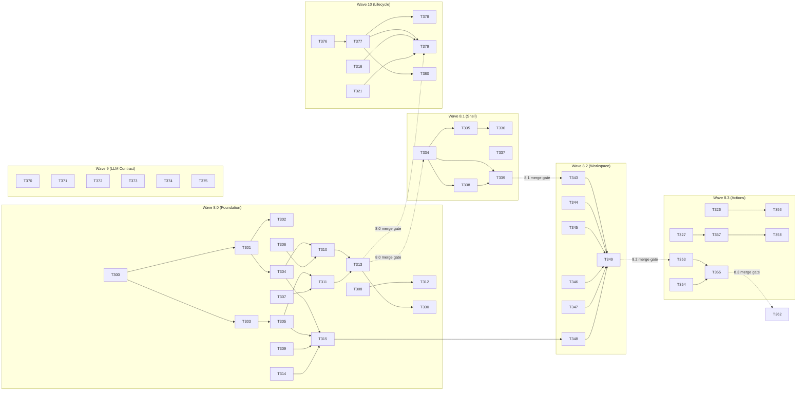

# Phase 2 Tasks — Premium Dark-Mode UI + Constitution VI + Backend Hardening

**Feature**: 002-phase2-premium-ui-rtl
**Plan**: [plan.md](file:///home/avril/QueryCraft/specs/002-phase2-premium-ui-rtl/plan.md)
**Spec**: [spec.md](file:///home/avril/QueryCraft/specs/002-phase2-premium-ui-rtl/spec.md)
**T-ID Range**: T-300 → T-399 (avoids collision with Phase 1 T-001..T-260)
**Obsolete**: T-258 (HistoryList aria-busy) — closed, HistoryPage replaced by Sidebar/SessionList

---

## Design Decisions (Locked)

1. **Session creation is lazy**: "New Chat" clears workspace + resets `activeSessionId=null`. First `POST /query/submit` with `session_id=null` creates the session server-side and returns the new `session_id`. No empty sessions in sidebar.
2. **DELETE undo is client-side**: 5-second client timer holds the DELETE API call. Undo cancels the timer (API never fires). Timer expiry fires `DELETE /sessions/:id` → server cascade-deletes. Server has NO undo state.
3. **useQuerySubmit extension belongs to Wave 8.2** (ships with PromptInput + chat rendering), NOT Wave 8.1.
4. **Lifecycle invariant migration**: 5 specific tests opted in. 2 are new in Wave 8.0; migration task in Wave 10 depends on Wave 8.0 merge.

---

## Wave 8.0 — Foundation (Stream 2A)

> **PR scope**: Backend data layer + API endpoints + frontend scaffold. NO visible UI change. Existing pages still render.
> **Verifies**: SC-014, SC-018, SC-019
> **Dependencies**: None — dispatches immediately

### Backend — Data Layer

- [X] T-300 [P] Create Alembic migration 004: sessions table, accepted_queries extensions (session_id, saved, feedback), seed llm_context_cap in app_config — `backend/alembic/versions/004_add_sessions_and_extend_accepted_queries.py` (FR-044, FR-045, ADR-1)
- [X] T-301 [P] Create Session SQLAlchemy model with relationship to AcceptedQuery — `backend/src/app/db/models/session.py` (FR-031)
- [X] T-302 Export Session model — `backend/src/app/db/models/__init__.py` (depends: T-301)
- [X] T-303 Add session_id FK, saved boolean, feedback smallint columns to AcceptedQuery model — `backend/src/app/db/models/accepted_query.py` (FR-045)
- [X] T-304 [P] Create SessionRepository with create(), list_by_user(), get_by_id(), delete(), update_last_activity(), update_preview_text() — `backend/src/app/repositories/session_repository.py` (FR-031, FR-032, FR-033, FR-043, FR-058)
- [X] T-305 [T-259] Refactor AcceptedQueryRepository: add list_by_session(), update_feedback(), get_latest_by_session() — `backend/src/app/repositories/accepted_query_repository.py` (FR-035, FR-036, FR-039)

### Backend — Schemas

- [X] T-306 [P] Create session Pydantic schemas: CreateSessionResponse, SessionSummary, SessionDetail, AttemptSummary, SessionListResponse — `backend/src/app/schemas/session.py`
- [X] T-307 [P] Create feedback Pydantic schemas: UpdateFeedbackRequest, FeedbackResponse — `backend/src/app/schemas/feedback.py` (FR-039)
- [X] T-308 [P] Create admin settings Pydantic schemas: AdminSettingsResponse, UpdateAdminSettingsRequest, UpdateAdminSettingsResponse — `backend/src/app/schemas/admin_settings.py` (FR-040, FR-046)
- [X] T-309 Add optional session_id field to SubmitQuestionRequest — `backend/src/app/schemas/query.py` (FR-035)

### Backend — API Endpoints

- [X] T-310 Create sessions router: POST/GET/GET:id/DELETE endpoints with auth — `backend/src/app/api/v1/sessions.py` (FR-031, FR-032, FR-033, FR-058; depends: T-304, T-306)
- [X] T-311 Create feedback router: PATCH /feedback/:attempt_id — `backend/src/app/api/v1/feedback.py` (FR-036, FR-039; depends: T-305, T-307)
- [X] T-312 [T-257] Add GET/PATCH /admin/settings endpoints for llm_context_cap — `backend/src/app/api/v1/admin.py` (FR-040, FR-046; depends: T-308)
- [X] T-313 Register sessions and feedback routers in app — `backend/src/app/main.py` (depends: T-310, T-311)

### Backend — Service Layer

- [X] T-314 Extend prompt_builder: accept optional conversation_history parameter — `backend/src/app/llm/prompt_builder.py` (FR-035)
- [X] T-315 Extend submit_question: lazy session creation (session_id=null → create server-side), load last N completed attempts (skip pending per FR-035 clarification), pass to prompt builder, update session.last_activity_at + preview_text on first message, apply implicit feedback on follow-up (FR-036a) — `backend/src/app/services/query_service.py` (FR-035, FR-036, FR-043, FR-058; depends: T-304, T-305, T-309, T-314)

### Backend — Tests

- [X] T-316 [P] Unit tests: SessionRepository CRUD — `backend/tests/unit/test_session_repository.py` (depends: T-304)
- [X] T-317 [P] Unit tests: AcceptedQueryRepository new methods (list_by_session, update_feedback, get_latest_by_session) — `backend/tests/unit/test_accepted_query_repository_extended.py` (depends: T-305)
- [X] T-318 [P] Integration tests: session creation, listing, deletion cascade, in-flight cancellation on delete — `backend/tests/integration/test_sessions.py` (depends: T-310)
- [X] T-319 [P] Integration tests: feedback PATCH endpoint — `backend/tests/integration/test_feedback.py` (depends: T-311)
- [X] T-320 [P] Integration tests: admin settings GET/PATCH with validation — `backend/tests/integration/test_admin_settings.py` (depends: T-312)
- [X] T-321 Acceptance test: submit-with-session-context flow (lazy creation, context loading, implicit feedback on follow-up) — `backend/tests/acceptance/test_session_conversation.py` (depends: T-315)

### Frontend — Scaffold

- [X] T-322 Install npm deps: zustand, @fontsource-variable/inter, @fontsource/jetbrains-mono, shiki — `frontend/package.json`
- [X] T-323 Add @theme block with QueryCraft design tokens (obsidian palette, neon accents, gradient keyframes, font families) + import fontsource — `frontend/src/index.css` (depends: T-322)
- [X] T-324 [P] Create Zustand UI store: sidebarCollapsed (persisted), activeSessionId, hoveredSessionId, promptDraft — `frontend/src/stores/uiStore.ts`
- [X] T-325 [P] Create TanStack Query hooks for sessions: useSessionsList, useSessionDetail, useCreateSession, useDeleteSession — `frontend/src/hooks/useSessions.ts`
- [X] T-326 [P] Create TanStack Query hooks for feedback: useUpdateFeedback — `frontend/src/hooks/useFeedback.ts`
- [X] T-327 [P] Create TanStack Query hooks for admin settings: useAdminSettings, useUpdateAdminSettings — `frontend/src/hooks/useAdminSettings.ts`
- [X] T-328 [P] Create icon barrel export (~13 icons: Plus, Sparkles, Copy, RefreshCw, ThumbsUp, ThumbsDown, Trash2, PanelLeftClose, PanelLeftOpen, Send, Download, Settings, X) — `frontend/src/components/icons.ts`
- [X] T-329 Add ~25 new i18n keys for session, feedback, sidebar, workspace, admin settings — `frontend/src/locales/en.json` + `frontend/src/locales/ar.json` (FR-041)
- [X] T-330 Regenerate frontend API client from updated OpenAPI — `frontend/scripts/generate-api-client.sh` (depends: T-313)

### Frontend — Tests

- [X] T-331 [P] Unit test: uiStore default state + persistence — `frontend/src/stores/__tests__/uiStore.test.ts` (depends: T-324)
- [X] T-332 [P] Unit tests: TanStack hooks mock API responses (sessions, feedback, admin settings) — `frontend/src/hooks/__tests__/useSessionsHooks.test.tsx` (depends: T-325, T-326, T-327)
- [X] T-333 Verify existing AskQuestionPage + HistoryPage tests still pass (SC-014 regression gate) — no new files

---

## Wave 8.1 — Shell (Stream 2A)

> **PR scope**: AppShell + Sidebar + SessionList + delete-with-undo + WorkspacePage routing. Chat UI not yet present.
> **Verifies**: FR-031, FR-032, FR-033, FR-034, FR-043, FR-049, FR-051, SC-023
> **Dependencies**: Wave 8.0 merged

### Components

- [X] T-334 Create AppShell: 2-column layout (collapsible sidebar + workspace), dir attribute bound to i18n, responsive breakpoints — `frontend/src/components/shell/AppShell.tsx` + `AppShell.css` (FR-049)
- [X] T-335 Create Sidebar: gradient logo, collapse toggle, "New Chat" CTA (clears workspace + resets activeSessionId=null, NO server call), chronological session groups — `frontend/src/components/sidebar/Sidebar.tsx` + `Sidebar.css` (FR-031, FR-034, FR-051; depends: T-334)
- [X] T-336 Create SessionItem: preview text, hover trash icon, click sets active session, active state styling — `frontend/src/components/sidebar/SessionItem.tsx` + `SessionItem.css` (FR-043; depends: T-335)
- [X] T-337 Create UndoToast: client-side 5s timer holds DELETE call, Undo cancels timer (API never fires), expiry fires DELETE then cascade-deletes server-side, multiple toasts stack — `frontend/src/components/sidebar/UndoToast.tsx` + `UndoToast.css` (FR-033, SC-023)
- [X] T-338 Create WorkspacePage: reads activeSessionId from Zustand, empty state ("Start a new conversation"), active session shows placeholder (chat UI ships in Wave 8.2) — `frontend/src/pages/WorkspacePage.tsx` (depends: T-334)

### Routing

- [X] T-339 Update App.tsx: wrap authenticated routes in AppShell, WorkspacePage as default route, preserve SignInPage — `frontend/src/App.tsx` (depends: T-334, T-338)

### Tests

- [X] T-340 [P] Unit test: Sidebar renders chronological session groups correctly (Today / Previous 7 Days / Older) — `frontend/src/components/sidebar/__tests__/Sidebar.test.tsx` (depends: T-335)
- [X] T-341 [P] Unit test: UndoToast timer behavior (fires DELETE after 5s, cancels on Undo) — `frontend/src/components/sidebar/__tests__/UndoToast.test.tsx` (depends: T-337)
- [X] T-342 Integration test: New Chat clears workspace, session delete→undo→restore flow — `frontend/src/components/sidebar/__tests__/SidebarIntegration.test.tsx` (depends: T-335, T-337)

---

## Wave 8.2 — Workspace Chat UI (Stream 2A)

> **PR scope**: UserBubble, AssistantResponseCard, SqlCodeBlock, ResultTable, PromptInput. Full chat UI live.
> **Verifies**: FR-042, FR-050, FR-052, FR-053, SC-020, SC-021, SC-022
> **Dependencies**: Wave 8.1 merged

### Components

- [X] T-343 [P] Create UserBubble: end-aligned, RTL-aware, dark-styled, logical directional properties only — `frontend/src/components/chat/UserBubble.tsx` + `UserBubble.css` (FR-053, SC-021)
- [X] T-344 [P] Create AssistantResponseCard: cyber-purple gradient border (p-px wrapper), contains SqlCodeBlock + placeholder action bar + ResultTable + placeholder feedback bar — `frontend/src/components/chat/AssistantResponseCard.tsx` + `AssistantResponseCard.css` (FR-050)
- [X] T-345 [P] Create SqlCodeBlock: Shiki lazy-loaded via React.lazy + Suspense, custom QueryCraft dark theme, loading skeleton — `frontend/src/components/chat/SqlCodeBlock.tsx` + `SqlCodeBlock.css` (FR-042)
- [X] T-346 [P] Create ResultTable: horizontal scroll, alternating purple-tinted rows, column headers from QueryResult — `frontend/src/components/chat/ResultTable.tsx` + `ResultTable.css` (FR-050)
- [X] T-347 Create PromptInput: sticky bottom, rounded textarea, Send icon on logical end side, cyan focus glow, RTL-aware — `frontend/src/components/chat/PromptInput.tsx` + `PromptInput.css` (FR-052)

### Workspace Wiring

- [X] T-348 Extend useQuerySubmit: accept session_id, lazy session creation (null → server creates + returns session_id → update Zustand activeSessionId + invalidate sessions query), pass session_id on follow-up — `frontend/src/hooks/useQuerySubmit.ts` (FR-035; depends: T-315)
- [X] T-349 Wire WorkspacePage: replace placeholder with chat conversation (UserBubble + AssistantResponseCard pairs), PromptInput at bottom, connect to extended useQuerySubmit — `frontend/src/pages/WorkspacePage.tsx` (depends: T-343, T-344, T-345, T-346, T-347, T-348)

### Tests

- [X] T-350 [P] Unit tests: UserBubble, AssistantResponseCard, ResultTable render with mock data — `frontend/src/components/chat/__tests__/ChatComponents.test.tsx` (depends: T-343, T-344, T-346)
- [X] T-351 [P] Unit test: SqlCodeBlock renders highlighted SQL with Shiki — `frontend/src/components/chat/__tests__/SqlCodeBlock.test.tsx` (depends: T-345)
- [X] T-352 [P] Unit test: PromptInput focus glow, Send button position, RTL alignment — `frontend/src/components/chat/__tests__/PromptInput.test.tsx` (depends: T-347)

---

## Wave 8.3 — Action Bars + Admin Settings UI (Stream 2A)

> **PR scope**: CodeBlockActionBar, ResponseFeedbackBar, implicit feedback wiring, admin Settings page.
> **Verifies**: FR-036, FR-037, FR-038, FR-039, FR-040, SC-024
> **Dependencies**: Wave 8.2 merged

### Components

- [X] T-353 [P] Create CodeBlockActionBar: Copy (clipboard write + confirmation animation), Regenerate (old attempt feedback=-1, triggers regen), ThumbsDown — `frontend/src/components/chat/CodeBlockActionBar.tsx` + `CodeBlockActionBar.css` (FR-037, FR-038)
- [X] T-354 [P] Create ResponseFeedbackBar: ThumbsUp (+1, saved=true), ThumbsDown (-1), mutual exclusion, selected state — `frontend/src/components/chat/ResponseFeedbackBar.tsx` + `ResponseFeedbackBar.css` (FR-039)
- [X] T-355 Integrate CodeBlockActionBar + ResponseFeedbackBar into AssistantResponseCard (replace placeholders) — `frontend/src/components/chat/AssistantResponseCard.tsx` (depends: T-353, T-354)
- [X] T-356 Wire implicit feedback on follow-up: prior attempt gets +1 if feedback=null, integrate with useFeedback mutation — `frontend/src/pages/WorkspacePage.tsx` (FR-036a; depends: T-326)

### Admin Settings Page

- [X] T-357 Create SettingsPage: LLM context cap input (0–10 validation), save button, success/error feedback — `frontend/src/pages/SettingsPage.tsx` + `SettingsPage.css` (FR-040; depends: T-327)
- [X] T-358 Add /settings route with AuthGuard — `frontend/src/App.tsx` (depends: T-357)

### Tests

- [ ] T-359 [P] Unit test: Copy button triggers clipboard API, Regenerate triggers mutation — `frontend/src/components/chat/__tests__/CodeBlockActionBar.test.tsx` (depends: T-353)
- [ ] T-360 [P] Unit test: Feedback buttons toggle state, mutual exclusion — `frontend/src/components/chat/__tests__/ResponseFeedbackBar.test.tsx` (depends: T-354)
- [ ] T-361 [P] Unit test: SettingsPage saves context cap, rejects out-of-range — `frontend/src/pages/__tests__/SettingsPage.test.tsx` (depends: T-357)

---

## Wave 8.4 — RTL Hardening + Polish Drain (Stream 2A)

> **PR scope**: Full RTL visual snapshots, Arabic translation quality, lint extensions, Lighthouse.
> **Verifies**: FR-041, FR-054, FR-055, FR-056, FR-057, SC-015, SC-020, SC-021
> **Dependencies**: Wave 8.3 merged

### Playwright RTL Snapshots

- [ ] T-362 Playwright visual snapshots for all new components in dir="ltr" AND dir="rtl": AppShell, Sidebar, SessionItem, WorkspacePage, UserBubble, AssistantResponseCard, SqlCodeBlock, ResultTable, PromptInput, CodeBlockActionBar, ResponseFeedbackBar, SettingsPage, UndoToast — `frontend/tests/e2e/rtl-snapshots.spec.ts` (FR-041, SC-021)

### Arabic Translation Quality

- [ ] T-363 Replace machine-translated Arabic stubs with reviewed translations for all ~25+ new keys — `frontend/src/locales/ar.json` (FR-041)

### Phase 1 Polish Backlog

- [ ] T-364 [T-253] Extract FILTER_DEBOUNCE_MS as named constant — `frontend/src/hooks/useDebounce.ts` (FR-054)
- [ ] T-365 [T-254] Extend stylelint property-disallowed-list: add left, right, float, border-left-*, border-right-* — `frontend/.stylelintrc.json` (FR-055)
- [ ] T-366 [T-255] Physical-tailwind test: scan source for ml-, mr-, pl-, pr-, left-, right- utility classes — `frontend/tests/lint/physical-tailwind.test.ts` (SC-021)
- [ ] T-367 [T-256] i18n key completeness test: beforeAll() loads locale files, asserts all en keys exist in ar and vice versa — `frontend/tests/lint/i18n-completeness.test.ts` (FR-056)
- [ ] T-368 [T-260] Remove defaultValue fallback from t() calls + configure saveMissing handler in i18n config — `frontend/src/i18n.ts` + grep all t() calls in src/ (FR-057)

### Performance

- [ ] T-369 Lighthouse desktop performance audit ≥ 85 — run audit, fix any blocking issues (SC-015)

---

## Wave 9 — Real-LLM Contract Verification (Stream 2B)

> **PR scope**: respx-mocked Gemini contract tests. Fully independent of Stream 2A.
> **Verifies**: FR-047, SC-016
> **Dependencies**: None — dispatches immediately (parallel with Wave 8.0)

- [ ] T-370 [P] Contract test: happy path — 200 with valid JSON, SQL extracted correctly — `backend/tests/contract/test_gemini_contract.py` (FR-047)
- [ ] T-371 [P] Contract test: 429 rate limit — clear error, no crash — `backend/tests/contract/test_gemini_contract.py` (FR-047)
- [ ] T-372 [P] Contract test: 5xx server error — clear service-unavailable error — `backend/tests/contract/test_gemini_contract.py` (FR-047)
- [ ] T-373 [P] Contract test: malformed response (invalid JSON / missing candidates) — graceful handling — `backend/tests/contract/test_gemini_contract.py` (FR-047)
- [ ] T-374 [P] Contract test: schema-context-too-long — token-limit error surfaced — `backend/tests/contract/test_gemini_contract.py` (FR-047)
- [ ] T-375 [P] Optional: weekly CI job for real Gemini API contract run — `.github/workflows/llm-contract-weekly.yml`

---

## Wave 10 — Lifecycle Invariant Test Framework (Stream 2C)

> **PR scope**: pytest fixture pattern for cross-test state leak detection. Fully independent.
> **Verifies**: FR-048, SC-017
> **Dependencies**: Wave 8.0 merged (2 of the 5 migrated tests are created in Wave 8.0)

- [ ] T-376 Create invariant registry: InvariantChecker base class + 3 example invariants (lock, feedback-state, session-touch) — `backend/tests/lifecycle/invariants.py` + `backend/tests/lifecycle/__init__.py` (FR-048)
- [ ] T-377 Create lifecycle conftest: autouse fixture for @pytest.mark.lifecycle tests, snapshots Redis+DB state at start, validates at end — `backend/tests/lifecycle/conftest.py` (depends: T-376)
- [ ] T-378 Document framework: how to add invariants, how to opt in, 3 example invariants — `backend/tests/lifecycle/README.md` (SC-017; depends: T-376)
- [ ] T-379 Migrate 5 existing tests to lifecycle fixtures: test_query_service_submit_question (lock), test_query_service_reject (lock), test_feedback_repository_update (feedback-state), test_session_repository_touch (session-touch, new in W8.0), test_query_service_submit_with_session (combined, new in W8.0) — various test files (depends: T-377, T-316, T-321)
- [ ] T-380 Validation test: intentionally introduced leaks are detected, clean tests pass without false positives — `backend/tests/lifecycle/test_invariant_detection.py` (depends: T-377)

---

## Dependency Graph

---

## Summary

| Wave | Stream | Tasks | T-ID Range | Parallel Opps |
|------|--------|-------|------------|---------------|
| 8.0 | 2A | 34 | T-300 → T-333 | 16 [P] tasks |
| 8.1 | 2A | 9 | T-334 → T-342 | 2 [P] tasks |
| 8.2 | 2A | 10 | T-343 → T-352 | 7 [P] tasks |
| 8.3 | 2A | 9 | T-353 → T-361 | 5 [P] tasks |
| 8.4 | 2A | 8 | T-362 → T-369 | 0 (sequential) |
| 9 | 2B | 6 | T-370 → T-375 | 6 [P] tasks |
| 10 | 2C | 5 | T-376 → T-380 | 0 (sequential) |
| **Total** | | **81** | **T-300 → T-380** | **38 parallel** |

### Phase 1 Polish Backlog Cross-Reference

| Original T-ID | Phase 2 T-ID | Description | Wave |
|---------------|-------------|-------------|------|
| T-253 | T-364 | FILTER_DEBOUNCE_MS constant | 8.4 |
| T-254 | T-365 | Stylelint extension | 8.4 |
| T-255 | T-366 | Physical-tailwind test | 8.4 |
| T-256 | T-367 | i18n key completeness test | 8.4 |
| T-257 | T-312 | Admin OpenAPI settings endpoints | 8.0 |
| T-258 | — | HistoryList aria-busy — **OBSOLETE** (HistoryPage replaced) | — |
| T-259 | T-305 | AcceptedQueryRepository refactor | 8.0 |
| T-260 | T-368 | defaultValue removal + saveMissing | 8.4 |
