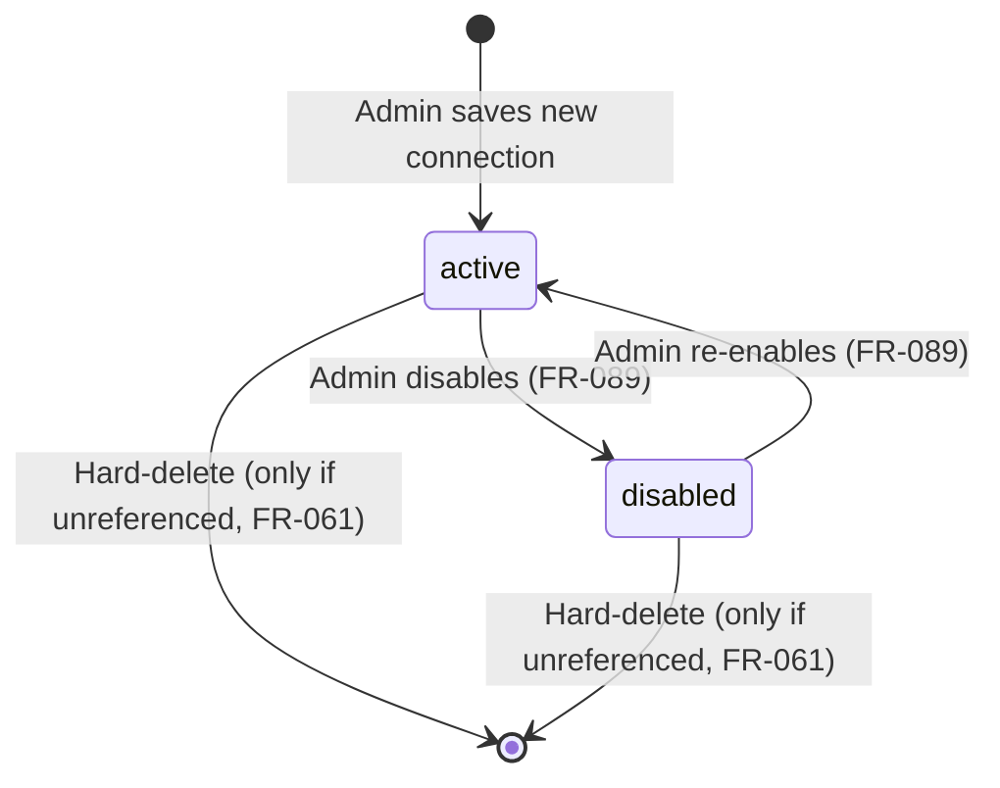
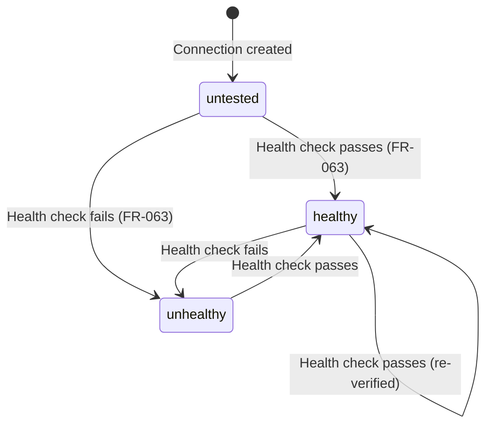
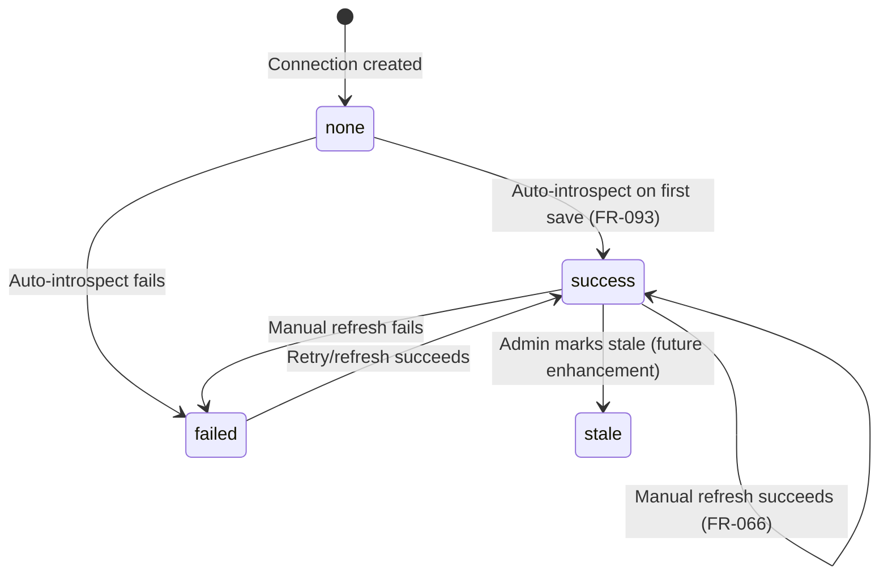

# Data Model — Phase 3: Multi-Dialect SQL and Multiple Source Databases

**Created**: 2026-05-18
**Source**: [spec.md](file:///home/avril/QueryCraft/specs/003-multi-dialect-source-dbs/spec.md)

---

## Enums

### `DatabaseType`
```python
class DatabaseType(str, enum.Enum):
    POSTGRESQL = "postgresql"
    MYSQL = "mysql"
    MSSQL = "mssql"
```

### `LifecycleState`
```python
class LifecycleState(str, enum.Enum):
    ACTIVE = "active"
    DISABLED = "disabled"
```

### `HealthStatus`
```python
class HealthStatus(str, enum.Enum):
    UNTESTED = "untested"
    HEALTHY = "healthy"
    UNHEALTHY = "unhealthy"
```

### `SchemaIntrospectionStatus`
```python
class SchemaIntrospectionStatus(str, enum.Enum):
    NONE = "none"
    SUCCESS = "success"
    FAILED = "failed"
    STALE = "stale"
```

---

## Entity: `SourceDatabaseConnection`

**Table name**: `source_database_connections` (renamed from `database_connections`)

| Column | Type | Nullable | Default | Notes |
|--------|------|----------|---------|-------|
| `id` | UUID | NO | `gen_random_uuid()` | PK |
| `display_name` | VARCHAR | NO | — | User-visible name (not unique) |
| `database_type` | `DatabaseType` enum | NO | — | PG/MySQL/MSSQL |
| `host` | VARCHAR | NO | — | |
| `port` | INTEGER | NO | Dialect default (5432/3306/1433) | |
| `database_name` | VARCHAR | NO | — | |
| `username` | VARCHAR | NO | — | |
| `encrypted_password` | VARCHAR | NO | — | Fernet-encrypted; never returned in API |
| `ssl_mode` | VARCHAR | NO | `"require"` | Preserved from Phase 1/2 |
| `lifecycle_state` | `LifecycleState` enum | NO | `"active"` | Independent of health |
| `health_status` | `HealthStatus` enum | NO | `"untested"` | Independent of lifecycle |
| `last_health_check_at` | TIMESTAMPTZ | YES | NULL | Updated on test-connection |
| `health_error_category` | VARCHAR | YES | NULL | e.g., `auth_failed`, `network_unreachable` |
| `schema_introspection_status` | `SchemaIntrospectionStatus` enum | NO | `"none"` | |
| `schema_last_refreshed_at` | TIMESTAMPTZ | YES | NULL | |
| `created_at` | TIMESTAMPTZ | NO | `now()` | |
| `updated_at` | TIMESTAMPTZ | NO | `now()` | Auto-updated |

**Indexes**:
- PK on `id`
- Index on `lifecycle_state` (for filtering active connections in user-facing queries)

**Relationships**:
- One-to-many → `ConnectionSchemaEntry`
- One-to-many → `AcceptedQuery` (via `database_connection_id`)
- One-to-many → `Session` (via `connection_id`)

---

## Entity: `ConnectionSchemaEntry`

**Table name**: `connection_schema_entries`

| Column | Type | Nullable | Default | Notes |
|--------|------|----------|---------|-------|
| `id` | UUID | NO | `gen_random_uuid()` | PK |
| `connection_id` | UUID | NO | — | FK → `source_database_connections.id`, CASCADE DELETE |
| `table_name` | VARCHAR | NO | — | |
| `column_name` | VARCHAR | NO | — | |
| `column_data_type` | VARCHAR | NO | — | Dialect-specific type string |
| `is_primary_key` | BOOLEAN | NO | `false` | |
| `foreign_key_table` | VARCHAR | YES | NULL | Referenced table if FK |
| `foreign_key_column` | VARCHAR | YES | NULL | Referenced column if FK |
| `introspected_at` | TIMESTAMPTZ | NO | `now()` | When this entry was captured |

**Indexes**:
- PK on `id`
- Index on `connection_id` (for cascade and lookup)
- Unique constraint on `(connection_id, table_name, column_name)` (no duplicate column entries per connection)

**Lifecycle**: On "Refresh Schema", all rows for the connection are DELETEd and re-inserted (full replace, no merge per FR-066).

---

## Entity: `Session` (MODIFIED)

**Table name**: `sessions` (existing)

| Column | Type | Nullable | Default | Notes |
|--------|------|----------|---------|-------|
| `connection_id` | UUID | YES | NULL | FK → `source_database_connections.id`, SET NULL on DELETE. Nullable: session starts with no selection (FR-094). |

**New column only**. All existing columns preserved.

---

## Entity: `AcceptedQuery` (VERIFIED)

**Table name**: `accepted_queries` (existing)

The `database_connection_id` column already exists as NOT NULL FK to `database_connections` (will be renamed to `source_database_connections`). **No schema change needed** beyond the FK target table rename.

---

## Migration Strategy

### Alembic Migration: `006_phase3_multi_dialect_connections.py`

**Operations** (single migration, atomic):

1. **Rename table**: `database_connections` → `source_database_connections`

2. **Add new columns** to `source_database_connections`:
   - `display_name VARCHAR NOT NULL DEFAULT ''` — then UPDATE from existing `name` column
   - `database_type VARCHAR NOT NULL DEFAULT 'postgresql'`
   - `lifecycle_state VARCHAR NOT NULL DEFAULT 'active'`
   - `health_status VARCHAR NOT NULL DEFAULT 'untested'`
   - `last_health_check_at TIMESTAMPTZ NULL`
   - `health_error_category VARCHAR NULL`
   - `schema_introspection_status VARCHAR NOT NULL DEFAULT 'none'`
   - `schema_last_refreshed_at TIMESTAMPTZ NULL`

3. **Backfill** existing rows: set `display_name` from `name`, `database_type` to `'postgresql'`.

4. **Drop column**: `name` (replaced by `display_name`), `schema_metadata` JSONB (replaced by `connection_schema_entries` table), `schema_cached_at` (replaced by `schema_last_refreshed_at`).

5. **Create table**: `connection_schema_entries` with columns as defined above.

6. **Add column** to `sessions`: `connection_id UUID NULL` with FK to `source_database_connections.id` ON DELETE SET NULL.

7. **Update FK** on `accepted_queries`: rename FK constraint target from `database_connections` to `source_database_connections`. (Alembic handles this with the table rename.)

### Backfill Verification (FR-091)

Migration tests MUST verify:
- (a) Existing `accepted_queries` rows retain valid `database_connection_id` pointing to the renamed table.
- (b) New `accepted_queries` rows require a non-null `database_connection_id`.
- (c) The legacy connection record has `database_type = 'postgresql'` and `lifecycle_state = 'active'`.

---

## State Transitions

### Connection Lifecycle State Machine



### Connection Health Status (independent of lifecycle)



### Schema Introspection Status (independent of lifecycle and health)


