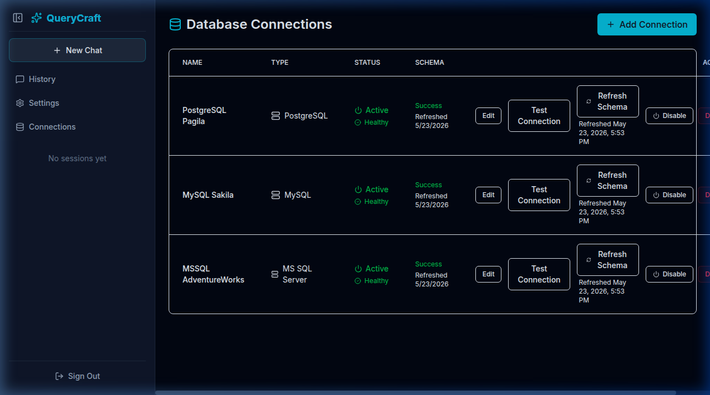

# Wave 16.3 — Database Prerequisites Verification

This document verifies that all three source database containers (PostgreSQL, MySQL, and Microsoft SQL Server) are running, healthy, and successfully registered and introspected in the QueryCraft Admin UI.

## Database Containers Status

All three database containers are running healthy on the QueryCraft Docker network:

| Container Name | Database Name | Health Status |
|---|---|---|
| `postgres-source` | `source_analytics` | Healthy |
| `mysql-source` | `sakila` | Healthy |
| `mssql-source` | `AdventureWorksLT` | Healthy |

> Note: Internal connection parameters (ports, usernames, passwords, hostnames) are excluded per Phase 4 evidence rules.

## Admin UI Verification

All connections have been successfully verified in the Admin UI at `http://localhost:3000/admin/connections`:

- **PostgreSQL Pagila**: Active/Healthy, Schema Introspection Status: `Success`
- **MySQL Sakila**: Active/Healthy, Schema Introspection Status: `Success`
- **MSSQL AdventureWorks**: Active/Healthy, Schema Introspection Status: `Success`

